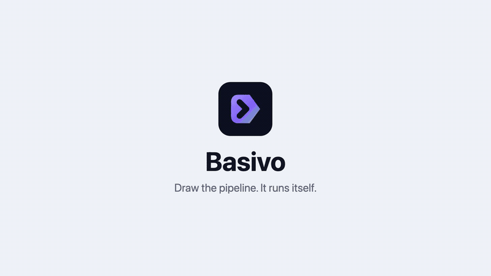

<div align="center">


# Basivo

**Agent pipelines that end in something real: a pull request, a video, a post, a reply.**

[](https://github.com/mohamedabubasith/basivo-orch/actions/workflows/ci.yml)
[](https://github.com/mohamedabubasith/basivo-orch/actions/workflows/security.yml)
[](https://github.com/mohamedabubasith/basivo-orch/releases)
[](LICENSE)



<sub>Made by this repository's own video node. The full forty two second film, with the run page and the receipt, is
<a href="https://github.com/mohamedabubasith/basivo-orch/raw/main/docs/media/basivo.mp4">here</a>.</sub>

</div>

## What it is

You draw a pipeline on a canvas, and it runs without you. What comes out the
other end is a thing, not a log line: a pull request, a rendered MP4, a voice
track, a montage, a post in a channel, a reply to the person who asked.

Inside a flow there are twenty three node types. An agent with real tools,
skills, sub-agents, MCP servers and hand over. A plain completion when no tools
are needed. Python in a sandbox, HTTP, conditionals, variables, chat memory
that survives between runs. Renders: video from React, images from HTML, a
photo montage, an invitation, speech from text. Delivery: a pull request, an
issue comment, a post to Telegram, Discord, Slack, Mastodon or Bluesky.

Something has to start it, and there are five ways: a webhook you own, which
registers itself against GitHub or Jira; a schedule; a Telegram bot; an API
call with your own key; or you, pressing run.

Model keys are yours. OpenAI, Anthropic, Gemini, Groq and others all go through
one table in `apps/api/basivo_orch/flows/nodes/models.py`, and every call
reports its tokens and its price on the run page.

## What one run looks like

Take the flow this repository uses on itself. A ticket goes in, an agent reads
it, changes the repository and opens a pull request. Thirty six seconds, nine
cents, and the pull request is real.

Take another. A schedule fires at nine, a model writes the copy, the video node
renders it, the speech node reads it, and the post lands in a Telegram channel
before anyone is at a desk.

Both are the same product. The cost is on the run page in both, because a
pipeline you cannot price is a pipeline you cannot run twice.

## What you can build

- **Issue to pull request.** A GitHub issue or a Jira ticket triggers an agent
  that edits the repository, opens the PR, and comments back on the issue.
- **A narrated video.** Write the script with an LLM, speak it, render the
  animation with Remotion, then post the file to Telegram or Discord.
- **A bot that answers.** A Telegram message triggers an agent with chat memory
  and its own tools, and the reply goes back to the same chat.
- **A scheduled post.** A cron trigger, an LLM that writes the copy, a video or
  an image render, and a post to Slack, Mastodon or Bluesky. Nobody is watching
  while it happens.
- **An invitation or a montage.** Photos and a few fields in, a rendered MP4
  out, addressed to the person who asked for it.

### The whole palette

Twenty three node types ship today, and none of them is a placeholder.

| | |
|---|---|
| **Triggers** | Run manually, a webhook (GitHub and Jira register themselves), a schedule, a Telegram bot |
| **Agents and models** | AI Agent with tools, skills, sub-agents, hand over and MCP servers; Write with AI for a plain completion; Chat Memory that survives between runs |
| **Code and data** | Python in a sandbox, HTTP Request, If / Else, Set Variables |
| **Repositories** | Fix Code and Open PR, Open Issue, Comment on Issue |
| **Media** | Make a Video, Describe a Video (the model writes the composition, we render it and check the frames), Photo Montage, Wedding Invitation, HTML to Image, Prepare Photo, Text to Speech |
| **Delivery** | Post to Social (Telegram, Discord, Slack, Mastodon, Bluesky), Telegram Reply |

Every model call reports its tokens and its price, whichever provider it went
to, and every render reports the seconds it took.

## Compared

People ask which tool this replaces, so here is the honest version.

| Instead of | What they are | What this does |
|---|---|---|
| n8n, Zapier | General automation with an AI node added to the palette. Video, if you need it, is a service you run beside them. | Built around the agent, and the render is a node on the same canvas. React goes in, an MP4 comes out. |
| Flowise and other chat builders | Aimed at a chat window with a person typing into it. | Aimed at work that finishes on a trigger or a schedule while nobody is watching, and leaves a file behind. |
| Hosted agent products | Model spend folded into a subscription you cannot see inside. | Your own keys, billed by the provider at their price, with tokens and dollars on every node of every run. |

The setup difference is the one you feel first. Connecting a repository
elsewhere means copying a webhook URL into GitHub settings, pasting a secret,
choosing events, and keeping all three in step. Here you pick the repository
and tick the events; publishing the flow registers the hook and holds the
secret. If you delete the flow, the hook goes with it.

Where the others win: n8n and Zapier connect to hundreds of applications. This
has twenty three node types. If the job is moving rows between SaaS tools, use
one of those and take the afternoon off.

## Building one

Drag a node onto the canvas and join it to the last one. Double click it and
its settings open in the middle of the screen, not in a panel squeezed against
the edge. A trigger explains itself: point the webhook at a GitHub repository,
tick the events you care about, and publishing registers the hook for you.
There is nothing to set up on GitHub.

Around the canvas there is a console: flows, runs, skills, credentials, API
keys, security and billing.

## Running it locally

You need Docker, [uv](https://docs.astral.sh/uv/) and Node 20 or newer.

```bash
make setup     # install deps, start Postgres, Redis and Mailpit, migrate
make dev       # API on :8000, the worker, and the web app on :5173
```

Registration emails land in Mailpit at http://localhost:8025, not in a real
inbox. `make help` lists the rest of the targets.

The API does not execute runs. It writes them queued and returns; the worker
claims them with `FOR UPDATE SKIP LOCKED` and runs them. So if runs sit at
queued, no worker is running. `make dev` starts one. `make worker` starts one
on its own.

## How it is put together

```
basivo-orch/
├── apps/
│   ├── api/                  FastAPI, SQLAlchemy, Alembic
│   │   └── basivo_orch/
│   │       ├── flows/        engine.py, graph.py, templating.py, nodes/
│   │       ├── auth/         generated by basivo-auth
│   │       ├── billing/  credentials/  skills/  admin/
│   │       └── worker.py     claims queued runs, fires schedules
│   └── web/                  React, Vite, Tailwind
│       └── src/
│           ├── builder/      the canvas, the inspector, node icons
│           └── routes/       landing, auth, and the console
├── deploy/                   one server: Compose, Caddy, Terraform
├── docs/                     SOW.md, video.md, billing.md, recipes/
├── docker-compose.yml        Postgres, Redis, Mailpit
└── Makefile
```

**Video renders with Remotion.** Remotion is source-available, free for up to
three people and paid above that, and that applies to anyone self-hosting this
too. It is written down in [`docs/video.md`](docs/video.md) rather than left in
a dependency list.

**Billing has one switch, `BILLING_MODE`.** In demo nothing is enforced and
nothing can be charged. See [`docs/billing.md`](docs/billing.md).

**Auth comes from a sibling project,
[basivo-auth](https://github.com/mohamedabubasith/basivo-auth).**
`apps/api/basivo_orch/auth/` is generated code and gets overwritten on a
recopy. The local edits are listed in
[`docs/generated-code-edits.md`](docs/generated-code-edits.md).

**Deployment is one server**: Docker, Postgres, Redis, Caddy. See
[`deploy/README.md`](deploy/README.md).

## Every run is observable

One row per node attempt, with status, duration, tokens and cost as columns.
Events are written with a gapless per-run sequence and then published, so you
can attach to a run already in progress, resume a dropped connection where it
stopped, and replay the whole thing afterwards.

## Tests

771 tests pass, including tests that encode real video. CI runs lint, the
suite, a migration up and back down against a real Postgres, both Docker
images, and a job that renders a video for real. A separate Security workflow
runs CodeQL, secret scanning, dependency audits and a container scan.

```bash
make test      # the API suite
make lint      # ruff, tsc, oxlint
```

## What it is not

- **It is v0.1.0, a pre-release.** It works, and it has not been through many
  hands yet.
- **It is not hosted.** You run it. One server is enough.
- **Nothing runs without a worker.** The API only queues.
- **It brings no model keys.** You add yours.
- **Video is not free above three people.** That is Remotion's licence, and it
  follows the repository.
- **Demo billing enforces nothing.** Do not read the plans on the billing page
  as limits until `BILLING_MODE` says production.

## Docs

| | |
|---|---|
| [`docs/SOW.md`](docs/SOW.md) | What the product is meant to be |
| [`docs/video.md`](docs/video.md) | The video nodes, the renderer, and Remotion's licence |
| [`docs/billing.md`](docs/billing.md) | The one switch and where limits are enforced |
| [`docs/recipes/`](docs/recipes) | Issue to PR, agent memory, agent skills, narrated video, autofix on failure |
| [`docs/generated-code-edits.md`](docs/generated-code-edits.md) | What was changed in generated auth code |
| [`deploy/README.md`](deploy/README.md) | The single-server deployment |
| [`CLAUDE.md`](CLAUDE.md) | Contributor rules, and the reasons behind them |

## Licence

MIT. See [`LICENSE`](LICENSE).

Remotion, which the video nodes use, is separate and not MIT: it is free for up
to three people and paid above that, and that applies to anyone self-hosting
this. See [`docs/video.md`](docs/video.md).
