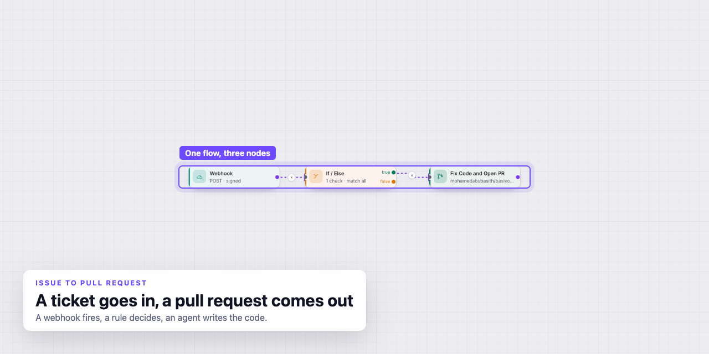
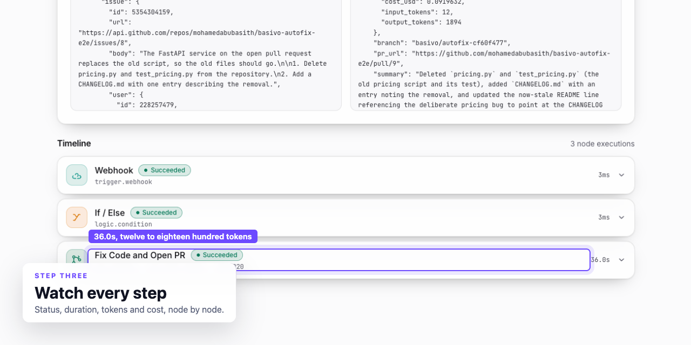
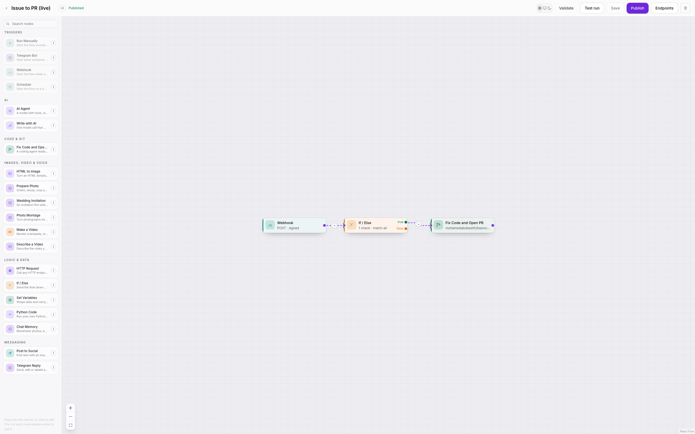
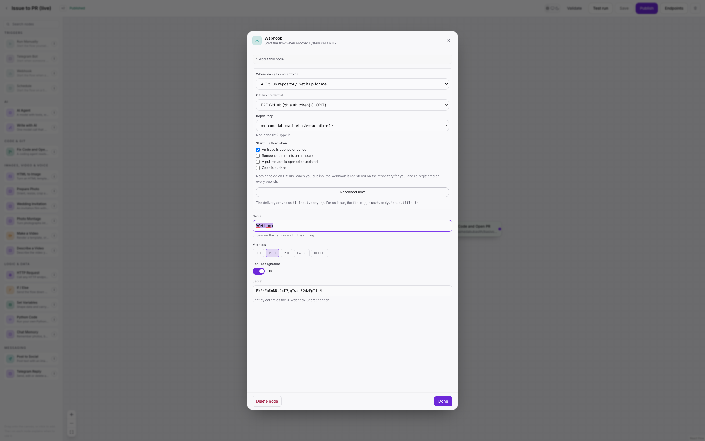

<sub>A ticket arrives, an agent reads the repository, a pull request comes out.</sub>

#  Basivo

Agent pipelines that end in something real: a pull request, a video, a post, a reply.

[](https://github.com/mohamedabubasith/basivo-orch/actions/workflows/ci.yml)
[](https://github.com/mohamedabubasith/basivo-orch/actions/workflows/security.yml)
[](https://github.com/mohamedabubasith/basivo-orch/releases)

## What it is

A trigger fires. A GitHub issue, a Jira ticket, a webhook, a schedule, a
Telegram message. A graph of nodes runs. Something comes out the other end that
a person can look at.

You build the graph on a canvas, configure each node in a dialog, and watch the
run afterwards: per node status, duration, tokens, cost, and an event log you
can replay. Model keys are yours. OpenAI, Anthropic, Gemini, Groq and others
all go through one table in `apps/api/basivo_orch/flows/nodes/models.py`.

## The headline flow

A ticket goes in. An agent reads it, changes the repository, and opens a pull
request. This works against real repositories today. One real run took 36
seconds and cost nine cents.



<sub>A finished run: the payload it started from, the timeline, and what each node cost.</sub>

The cost is on the run page because a pipeline you cannot price is a pipeline
you cannot run twice.

## What you can build

- **Issue to pull request.** A GitHub issue or a Jira ticket triggers an agent
  that edits the repository, opens the PR, and comments back on the issue.
- **A narrated video.** Write the script, speak it, render the animation with
  Remotion, then post the file to Telegram or Discord.
- **A bot that answers.** A Telegram message triggers an agent with chat memory
  and its own tools, and the reply goes back to the same chat.
- **A scheduled post.** A cron trigger, an agent that writes the copy, an image
  render, and a post to Slack, Mastodon or Bluesky.

Twenty-three node types ship today: the AI agent (tools, skills, sub-agents,
MCP servers, hand over), plain text generation, code in a sandbox, HTTP,
conditionals, set variables, chat memory, image render, video render, speech,
photo montage, wedding invitation, fix code and open a pull request, comment on
an issue, post to Telegram, Discord, Slack, Mastodon and Bluesky, and the
triggers.

## Building one



<sub>The canvas, with the palette on the left. Drag a node in, connect it, publish.</sub>



<sub>Node configuration opens in the middle of the screen. Here: which repository, which events.</sub>

Around the canvas there is a console: flows, runs, skills, credentials, API
keys, security and billing.

## Running it locally

You need Docker, [uv](https://docs.astral.sh/uv/) and Node 20 or newer.

```bash
make setup     # install deps, start Postgres, Redis and Mailpit, migrate
make dev       # API on :8000, the worker, and the web app on :5173
```

Registration emails land in Mailpit at http://localhost:8025, not in a real
inbox. `make help` lists the rest of the targets.

The API does not execute runs. It writes them queued and returns; the worker
claims them with `FOR UPDATE SKIP LOCKED` and runs them. So if runs sit at
queued, no worker is running. `make dev` starts one. `make worker` starts one
on its own.

## How it is put together

```
basivo-orch/
├── apps/
│   ├── api/                  FastAPI, SQLAlchemy, Alembic
│   │   └── basivo_orch/
│   │       ├── flows/        engine.py, graph.py, templating.py, nodes/
│   │       ├── auth/         generated by basivo-auth
│   │       ├── billing/  credentials/  skills/  admin/
│   │       └── worker.py     claims queued runs, fires schedules
│   └── web/                  React, Vite, Tailwind
│       └── src/
│           ├── builder/      the canvas, the inspector, node icons
│           └── routes/       landing, auth, and the console
├── deploy/                   one server: Compose, Caddy, Terraform
├── docs/                     SOW.md, video.md, billing.md, recipes/
├── docker-compose.yml        Postgres, Redis, Mailpit
└── Makefile
```

**Video renders with Remotion.** Remotion is source-available, free for up to
three people and paid above that, and that applies to anyone self-hosting this
too. It is written down in [`docs/video.md`](docs/video.md) rather than left in
a dependency list.

**Billing has one switch, `BILLING_MODE`.** In demo nothing is enforced and
nothing can be charged. See [`docs/billing.md`](docs/billing.md).

**Auth comes from a sibling project,
[basivo-auth](https://github.com/mohamedabubasith/basivo-auth).**
`apps/api/basivo_orch/auth/` is generated code and gets overwritten on a
recopy. The local edits are listed in
[`docs/generated-code-edits.md`](docs/generated-code-edits.md).

**Deployment is one server**: Docker, Postgres, Redis, Caddy. See
[`deploy/README.md`](deploy/README.md).

## Every run is observable

One row per node attempt, with status, duration, tokens and cost as columns.
Events are written with a gapless per-run sequence and then published, so you
can attach to a run already in progress, resume a dropped connection where it
stopped, and replay the whole thing afterwards.

## Tests

771 tests pass, including tests that encode real video. CI runs lint, the
suite, a migration up and back down against a real Postgres, both Docker
images, and a job that renders a video for real. A separate Security workflow
runs CodeQL, secret scanning, dependency audits and a container scan.

```bash
make test      # the API suite
make lint      # ruff, tsc, oxlint
```

## What it is not

- **It is v0.1.0, a pre-release.** It works, and it has not been through many
  hands yet.
- **It is not hosted.** You run it. One server is enough.
- **Nothing runs without a worker.** The API only queues.
- **It brings no model keys.** You add yours.
- **Video is not free above three people.** That is Remotion's licence, and it
  follows the repository.
- **Demo billing enforces nothing.** Do not read the plans on the billing page
  as limits until `BILLING_MODE` says production.

## Docs

| | |
|---|---|
| [`docs/SOW.md`](docs/SOW.md) | What the product is meant to be |
| [`docs/video.md`](docs/video.md) | The video nodes, the renderer, and Remotion's licence |
| [`docs/billing.md`](docs/billing.md) | The one switch and where limits are enforced |
| [`docs/recipes/`](docs/recipes) | Issue to PR, agent memory, agent skills, narrated video, autofix on failure |
| [`docs/generated-code-edits.md`](docs/generated-code-edits.md) | What was changed in generated auth code |
| [`deploy/README.md`](deploy/README.md) | The single-server deployment |
| [`CLAUDE.md`](CLAUDE.md) | Contributor rules, and the reasons behind them |

## Licence

There is no licence file in this repository yet, so all rights are reserved for
now. Remotion, which the video nodes use, has its own terms: see
[`docs/video.md`](docs/video.md).
